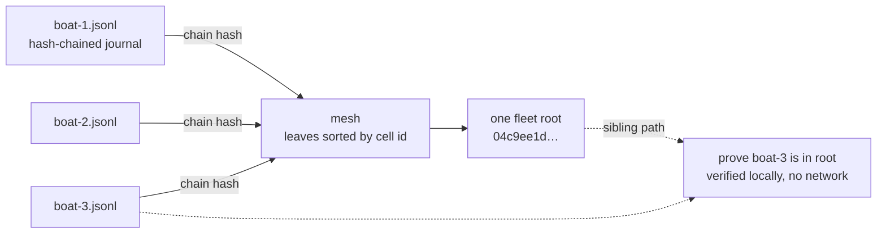

# MerkleMesh

**One fleet, one root.** MerkleMesh aggregates many quilt cell-ledger
journals into a single Merkle root, and proves that any one journal is
included in it — with nothing but hashes.



<!-- mermaid replaces the old ASCII sketch; the metaphor is unchanged:
     many boats, one root, proofs that never leave the wheelhouse. -->

## What it actually is

A small, dependency-free TypeScript library + CLI that:

1. **Verifies quilt cell-ledger journals.** A journal is JSONL — a header
   line plus hash-chained double-entry records exactly as quilt-core
   (Rust) emits them. MerkleMesh ports the chain rules bit-for-bit:
   entry seals, prev-links, and the genesis commit all reproduce the
   Rust hashes from the same entries. Five journals generated by
   quilt-core itself are in `test/fixtures/` and the test suite pins
   their exact chain hashes.
2. **Aggregates a fleet.** Each verified journal's chain hash becomes a
   Merkle leaf; the mesh root commits to every boat's entire history in
   one 64-hex string. Leaves are sorted by cell id, so the same set of
   journals always yields the same root regardless of directory order.
3. **Proves inclusion.** `merklemesh prove` checks the whole chain:
   your journal verifies, its chain hash is the one committed in the
   mesh, and the sibling path folds back to the fleet root. Any edit to
   any entry of any journal — including rewriting `77.5` as `77` —
   breaks the proof.

## The hard part (and why this isn't trivial)

The quilt ledger hashes entries over *canonical JSON* with serde_json /
ryū number semantics: `40.0` is a float and must render as `40.0`.
JavaScript's `JSON.parse` erases that distinction (`40.0` → `40`),
which would silently change every hash — the porting hazard is called
out explicitly in quilt's `docs/cell-ledger.md`. MerkleMesh carries a
number-preserving JSON parser and canonicalizer (with a zero-dependency
SHA-256) so a Rust-generated journal verifies through TypeScript
unchanged. The golden fixtures prove it: same bytes in, same hashes out.

Honest boundary: floats outside the plain-decimal range (|x| < 1e-5 or
≥ 1e16) are rejected rather than hashed wrong; real ledger values
(timestamps, sensor readings) never get there.

## CLI

```
merklemesh verify <journal.jsonl>
    Verify one journal's hash chain end to end.

merklemesh aggregate <dir|journal.jsonl...> [--root-only] [--mesh <path>] [--proofs]
    Verify every *.jsonl journal and build the fleet mesh.
    Writes ./mesh.json (or --mesh path); --root-only prints just the
    root; --proofs also writes <cell_id>.proof.json per journal.
    Journals that fail verification are skipped and reported on stderr.

merklemesh prove <journal.jsonl> --mesh <mesh.json> [--root <hex>]
    Verify the journal's chain AND its inclusion in the fleet root.
```

Example (root from the test fixtures — try it yourself):

```
$ merklemesh verify boat-1.jsonl
ok  boat-1.jsonl  cell=bilge.level  entries=3  chain_hash=7b8966bb…

$ merklemesh aggregate .
04c9ee1df4c06fd0516bcf23d2cda6f6c35a7c2a244ad734d3925202d36e5635
mesh   5 ledgers -> mesh.json

$ merklemesh prove boat-3.jsonl --mesh mesh.json
ok  boat-3.jsonl  cell=sonar.range  chain=cf541a82a1b2ae97…  root=04c9ee1d…

$ sed 's/"value":77.5/"value":99.5/' boat-1.jsonl > evil.jsonl
$ merklemesh verify evil.jsonl
merklemesh: chain broken at seq 2: seal mismatch at seq 2 …
```

## Library

```ts
import { loadJournal, verifyJournal, buildMesh, proveMesh, verifyInclusion } from "merklemesh";

const journal = await loadJournal("boat-1.jsonl");     // parse + structure
const audit = verifyJournal(journal);                   // { intact, firstBreak, headerOk }
const mesh = buildMesh([j1, j2, j3]);                   // { root, leaves, skipped }
const proof = proveMesh(mesh, "bilge.level");           // sibling path
verifyInclusion(journal, proof);                        // { ok, reasons }
```

## Mesh construction (pinned)

```
leaf   = sha256(canonical({"kind":"merklemesh/leaf/1","cell_id":…,"chain_hash":…,"entries":N}))
node   = sha256(canonical({"kind":"merklemesh/node/1","left":…,"right":…}))
```

Leaves sort by cell id (UTF-8 byte order). Odd counts duplicate the
last node of each level (the Bitcoin convention). Duplicate cell ids
are rejected — one leaf per boat. Breaking any journal's chain, or
meshing a different set, changes the root.

## Tests

49 tests: NIST/cross-checked SHA-256 vectors; canonical-form rules
including the pinned vectors from quilt-core's own test suite; the five
Rust-generated golden journals (exact chain hashes); tamper detection
at the right sequence number (value edit, float-marker erasure, forged
prev-link, stale header); mesh determinism, root sensitivity, proof
verification and rejection; full CLI runs including failure exits.

```
npm install && npm test
```

## Status

v0.1.0 — verify, aggregate, prove; read-only over journal files. The
ledger format is quilt's `quilt-cell-ledger/1`; if quilt bumps the
chain version, this follows.

## Lineage

This repository is a fork of
[fuad403273/MerkleMesh](https://github.com/fuad403273/MerkleMesh) —
an unstarted, AI-generated stub. The working system here (the ledger
port, the number-preserving canonicalizer, the mesh, the tests) was
written fresh for the SuperInstance fleet, on top of the quilt
cell-ledger. Credit to the original for the name; everything that runs
is ours.

## License

Apache-2.0
